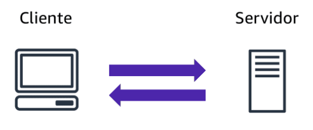

## Objetivos
- Resumir los beneficios de AWS.
- Describir las diferencias entre la entrega bajo demanda y las implementaciones en la nube.
- Resumir el modelo de precios de pago por uso.

## Modelo cliente-servidor
En cómputo, un **cliente** puede ser un navegador web o una apliacción de escritorio con la que intectura una persona para realizar solicitudes a los servidores de cómputo. Un **servidor** puede ser un servicios, como **Amazon Elastic Computer Cloud (Amazon EC2)**, un tipo de **servidor virtual.**  

  
\
Cómputo en la nube
==  

### Modelos de implementación para el cómputo en la nube
La empresa debe tener en cuenta los factores, como los **componentes necesarios de las aplicaciones en la nube**, las **herramentas de administración de recursos** preferidas y los **requisitos de infraestructura de TI** heredara.  

Los **modelos de implementación** de cómputo en la nube están basados en **la nube**, **las instalaciones** y de **forma híbrida**.  

- ***Implementación basada en la nube***
    - Ejecute todas las partes de la aplicación en la nube.
    - Migración de aplicaciones a la nube.
    - Diseño y creación de nuevas aplicaciones en la nube.
- ***Implementación en las instalaciones***
    - Implementa recursos mediante herramientas de virtualización y administración.
    - Administra la utilización de recursos mediante tecnologías de virtualización y administración de aplicaciones.
- ***Implementaicón híbrida***
    - Conectr recursos basados en la nube a la infraestructura en las instalaciones.
    - Integra recursos basados en la nube con aplicaciones heredadas.  

### Beneficios del cómputo en la nube  
- Cambiar gastos iniciales por gastos variables
- Dejar de gastar dinero en la ejecución y el mantenimiento de centros de datos
- Deje de hacer conjeturas sobre la capacidad
- Obtener beneficios de las grandes economísa de escala
- Aumentar la velocidad y agilidad
- Convertirse en una empresa global en cuestión de minutos