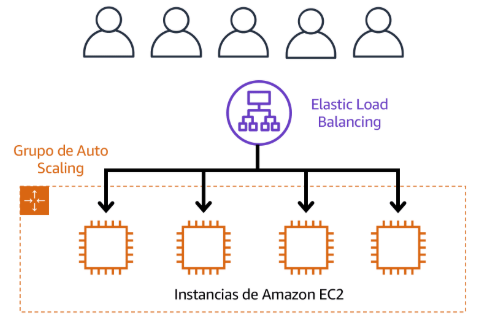

## Objetivos
- Describir los beneficios de Amazon EC2 a nivel básico
- Ifentificar los distintos ***tipos de instancias de Amazon EC2***
- Diferencias entre las distintas ***opciones de facturación*** de Amazon EC2
- Resumir los ***beneficios de Amazon Ec2 Auto Scalling***
- Resumir los ***beneficios*** de ***Elastic Load Balancing***
- Dar un ***ejemplo*** de los usos de ***Elastic Load Balancing***
- Resumir las ***diferencias*** entre ***Amazon Simple Notification Services (Amazon SNS)*** y ***Amazon Simple Queue Service (Amazon SQS)***
- Resumir las opciones de cómputo adicionales de AWS

## Amazon Elastic Complute Cloud (Amazon EC2)  
Servidor virtual para ejecutar aplicaciones en la nube de AWS.
- Aprovisionar y lanzar instancias
- Puede dejar ser usarse cuando haya terminado de ejecutar una carga de trabajo.
- Solo paga por el tiemp ode cómputo que utilizar cuando una instancia está ejecutando.
- Ahorrar costos si solo paga por la capacidad del servidor que necesite o desee.  

## Tipos de Instnacias de Amazon EC2  
Amazon EC2 está optimizado para distintas tareas. Debe tener en cuenta las necesidades específicas.
- ***Instancias de propósito general***: Equilibrio entre recursos de cómputo, de memoria y redes.
    - Servidores de aplicaciones
    - Servidores de juegos
    - Servidores backend
    - bases de datos pequeñas y medianas

- ***Instancias de cómputo optimizado***: Aplicaciones que requieren de procesadores de alto rendimiento. puede usar instancias de cómputo optimizado para cargas de trabajo como servidores web, aplicaciones y juegos.  

- ***Instancias optmizadas de memoria***: Ofrecen un rendimiento rápido para las cargas de trabajo que procesan grandes conjuntos de datos en memoria.   

- ***Instancias de cómputo acelerado***: Utilizar aceleradores de hardware, o coprocesadores, para realizar algunas funciones de manera más eficientes de lo que es posible en el software que se ejecuta en las CPU. Ejemlos:
    - Cálculos numéricos de punto flotante
    - Procesamiento de grados
    - Conincidencia de patrones de datos

- ***Instancias optmizadas de almacenamieto***: Diseñada par a las cargas de trabajo que necesitan realizar con gran frecuencia accesos secuanciales de lectura y escritura a conjuntos de datos grandes en el almacenamiento local. Ejemplos: 
     - Sistemas de archivos distribuidos
     - Aplicaciones de almacén de datos
     - Sistemas de procesmaiento de transacciones en linea de alta frecuencia (OLTP)  

> (IOPS): es una métrica que mide el rendimiento de un dispositivo de almacenamiento. Indica cuántas operaciones de entrada o salida diferentes puede realizar un dispositivo en un segundo  

## Precios de Amazon EC2  
Ofrece diversas ***opciones de precios para distintos casos de uso***. Por ejemplos, si su caso práctico puede soportar interrupciones, puede ahorrar con las instancias de spot. También puede ahorrar si se compromete de forma anticipada y reserva un nivel mínimo de uso con las instancias reservadas.  
- ***Bajo demanda***: Ideal para cargas de trabajo irregulares a corto plazo que no se puede interrumpir. No se aplican costos iniciales no contratos mínimos. Solo paga por el tiepo de cómputo que utiliza.

- ***Instancias reservadas***: Son un descuento de facturación que se aplica al uso de instancias bajo demanda en su cuente. Puede comprar las instancias reservadas por un periodo de 1 a 3 años.
    - Instancias reservadas Standard: esta opción es buena si conoce el tipo de instancia de EC2 y el tamaño que necesita para las aplicaciones de estado estable y en qué región de AWS planea ejecutarlas.
    - Instancias reservadas Convertibles: En caso deba ejecutar instancias de EC2 en un zona de disponibilidad diferente o tipos de instancias diferentes.

- ***Savings Plans de una Instancia de EC2***: Reducen los costos de las instancias de EC2 cuando se comprometa a realizar gastos por hora a una familia de instancias y a una región por un periodo de 1 a 3 años.
- ***Instancias de Spot***: Permite aprovechar la capacidad de cómputo no utilizada de AWS a un precio mucho más bajo (hasta un 90% de descuento) en comparación con las instancias bajo demanda.
- ***Servidores dedicados***: Son servidores físicos con capacidad de instancias de Amazon EC2 totalmente dedicados a su uso. Puede utilizar las licencias de software por zócalo, por núcleo o por máquina virtual (VM).

## Escalabilidad  
Implica comenzar solo con los recursos que necesita y diseñar la arquitectura para **responde automáticamente a la demanada cambiante mediante** el escalado o la reducción horizontal.

> Si quisiera que el proceso de escalado se realizara automáticamente, ¿Qué servicio de AWS utilizada? El servicio de AWS que proporciona esta funcionalidad para las instanacias de Amazon EC2 es **Amazon EC2 Auto Scaling**  

## Amazon EC2 Auto Scaling  
Permite **anadir o eliminar automaticamente instancias de Amazon EC2** en respuesta a la demanda cambiante de las aplicaciones. Al escalar y reducir horizontalmente de forma automática sus instancias según sea necesario, podrá mantener una **mayor sensación de disponibilidad de las aplicaciones**.  
En Amazon EC2 Auto Scaling, puede utilizar 2 enfoques, escalado dinámico y escalado predictivo.
- El ***escalado dinámico*** responde a la demanda cambiante.
- El ***escalado predictivo*** programa automáticamente el número correcto de instancias de Amazon EC2 en función a la demanda prevista.

## Dirección de tráfico con Elastic Load Balancing  
Es el servicio de AWS que ``distribuye automáticamente el tráfico de aplicaciones`` entrantes entre varios recursos, como las instancias de Amazon EC2.  
Elastic Load Balancing distribuye la carga de trabajo entre las distintas instancias para que ninguna instancia tenga que cargar la mayor parte.  

  

